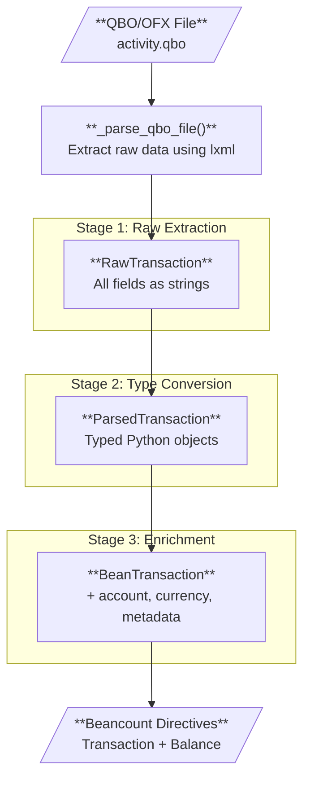
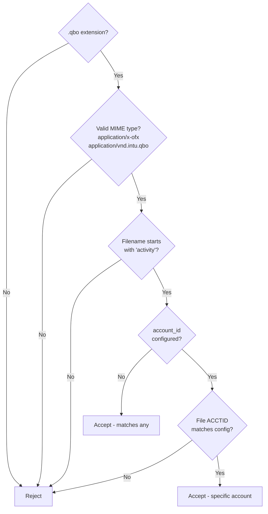
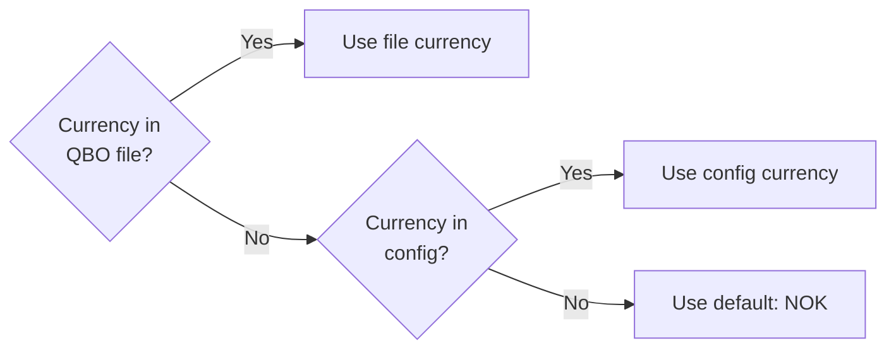

# Beancount No Amex - Pipeline Documentation

This document explains how QBO files from American Express are transformed into Beancount accounting entries.

## Pipeline Overview



### Data at Each Stage

| Stage | Model | Example |
|-------|-------|---------|
| Raw | `RawTransaction` | `date: "20250320000000.000[-7:MST]"`, `amount: "-895.45"` |
| Parsed | `ParsedTransaction` | `date: datetime.date(2025, 3, 20)`, `amount: Decimal("-895.45")` |
| Enriched | `BeanTransaction` | + `currency: "NOK"`, `account: "Liabilities:CreditCard:Amex"` |
| Final | `data.Transaction` | Beancount directive ready for `bean-check` |

## Data Models

### 1. RawTransaction

The first stage - direct extraction from XML. All fields are strings or None.

```python
class RawTransaction(BaseModel):
    date: str | None = None      # "20250320000000.000[-7:MST]"
    amount: str | None = None    # "-895.45"
    payee: str | None = None     # "SPOTIFY PREMIUM SPOTIFYPAY"
    memo: str | None = None      # "LINA HANSEN-81023"
    id: str | None = None        # "AT3456" (FITID)
    type: str | None = None      # "DEBIT" or "CREDIT"
```

### 2. ParsedTransaction

Validated and typed. The Pydantic model ensures data integrity.

```python
class ParsedTransaction(BaseModel):
    date: date                   # datetime.date(2025, 3, 20)
    amount: Decimal              # Decimal("-895.45")
    payee: str | None = None
    memo: str | None = ""
    id: str | None = None
    type: str | None = None
```

### 3. BeanTransaction

Enriched with Beancount-specific fields, ready for directive creation.

```python
class BeanTransaction(BaseModel):
    date: date
    amount: Decimal
    currency: str                # "NOK"
    payee: str | None = None
    narration: str = ""
    flag: str = "*"
    tags: set[str]
    links: set[str]
    account: str                 # "Liabilities:CreditCard:Amex"
    metadata: dict[str, str]
    matched_account: str | None  # "Expenses:Groceries" (from finalize)
```

### 4. QboFileData

Container for all data extracted from a single QBO file.

```python
class QboFileData(BaseModel):
    transactions: list[RawTransaction]
    balance: str | None          # "-35768.92"
    balance_date: date | None    # Date of balance assertion
    currency: str | None         # "NOK" (from CURDEF tag)
    account_id: str | None       # "XYZ|98765" (for multi-account)
    organization: str | None     # "AMEX"
```

## Key Processing Steps

### Step 1: File Identification (`identify`)



### Step 2: QBO Parsing (`_parse_qbo_file`)

Extracts from XML:
- `<CCACCTFROM>/<ACCTID>` → account_id
- `<FI>/<ORG>` → organization
- `<CURDEF>` → currency
- `<LEDGERBAL>` → balance + balance_date
- `<STMTTRN>` elements → transactions

### Step 3: Currency Determination (`_determine_currency`)



### Step 4: Transaction Creation (`extract`)

For each RawTransaction:
1. Parse date using `parse_ofx_time()`
2. Convert amount to `Decimal`
3. Build metadata (id, type, memo)
4. Create primary posting to credit card account
5. Apply `finalize()` for categorization

### Step 5: Categorization (`finalize`)

Matches narration against patterns:

```python
narration_to_account_mappings = [
    ('VINMONOPOLET', 'Expenses:Groceries'),
    ('SPOTIFY', 'Expenses:Entertainment:Music'),
]
```

If matched, adds a balancing posting with the opposite amount.

### Step 6: Balance Assertion

Creates a `data.Balance` directive for the day after the statement date.

## Example Transformation

**Input (QBO XML):**
```xml
<STMTTRN>
  <TRNTYPE>DEBIT</TRNTYPE>
  <DTPOSTED>20250320000000.000[-7:MST]</DTPOSTED>
  <TRNAMT>-742.18</TRNAMT>
  <FITID>AT250800024000010012345</FITID>
  <NAME>VINMONOPOLET GRUNERLOKKA OSLO</NAME>
  <MEMO>LINA HANSEN-81023</MEMO>
</STMTTRN>
```

**Output (Beancount):**
```beancount
2025-03-20 * "VINMONOPOLET GRUNERLOKKA OSLO"
  id: "AT250800024000010012345"
  type: "DEBIT"
  memo: "LINA HANSEN-81023"
  Liabilities:CreditCard:Amex  -742.18 NOK
  Expenses:Groceries            742.18 NOK
```

## Multi-Account Support

Configure multiple importers to handle different Amex cards:

```python
importers = [
    Importer(AmexAccountConfig(
        account_name='Liabilities:CreditCard:Amex:Personal',
        currency='NOK',
        account_id='XYZ|12345',  # Only matches this card
    )),
    Importer(AmexAccountConfig(
        account_name='Liabilities:CreditCard:Amex:Business',
        currency='NOK',
        account_id='XYZ|67890',  # Only matches this card
    )),
]
```

Each importer's `identify()` method checks if the file's `<ACCTID>` matches.
